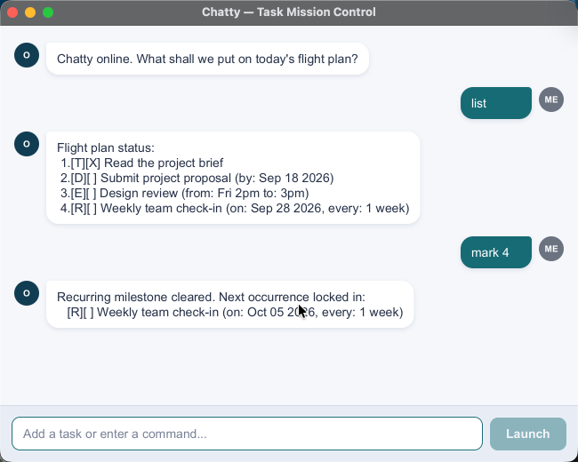

# Chatty User Guide

Chatty keeps your todos, deadlines, events, and recurring tasks in one flight
plan. Type a command, press **Enter** (or click **Launch**), and Chatty responds.
Your tasks are saved automatically between sessions.



## Quick start

1. Install Java 25.
2. Place `Chatty.jar` in a folder where you want to keep your tasks.
3. Open a terminal in that folder and run `java -jar Chatty.jar`.
4. Try `todo Read the project brief`, then `list`.

Building from source instead? Run `./gradlew shadowJar` with Java 25; the JAR
will be in `build/libs/Chatty.jar`. You can also launch with `./gradlew run`.
On Windows, use `gradlew.bat` instead of `./gradlew`.

## Commands at a glance

Use the lowercase command words below. Replace uppercase placeholders with your
own text; do not type the placeholder names. Dates use `YYYY-MM-DD`.

| Action | Format | Example |
| --- | --- | --- |
| Add a todo | `todo DESCRIPTION` | `todo Read the project brief` |
| Add a deadline | `deadline DESCRIPTION /by DATE` | `deadline Submit project proposal /by 2026-09-18` |
| Add an event | `event DESCRIPTION /from START /to END` | `event Design review /from Fri 2pm /to 3pm` |
| Add recurring work | `recurring DESCRIPTION /on DATE /every NUMBER UNIT` | `recurring Weekly team check-in /on 2026-09-21 /every 1 week` |
| Show all tasks | `list` | `list` |
| Find tasks | `find KEYWORD` | `find project` |
| Mark done | `mark INDEX` | `mark 1` |
| Undo completion | `unmark INDEX` | `unmark 1` |
| Delete a task | `delete INDEX` | `delete 2` |
| Exit | `bye` | `bye` |

## Adding tasks

- **Todos** have a description but no date.
- **Deadlines** have a valid calendar date. For example, `2026-09-18` is
  displayed as `Sep 18 2026`.
- **Events** have start and end text. Chatty keeps these values as entered,
  so use something clear such as `Fri 2pm` and `3pm`; it does not validate
  their chronological order.
- **Recurring tasks** have a next date and a repeating interval. Use a positive
  whole number and `day`, `week`, `month`, or `year` (plurals work too).

Descriptions and delimiter values cannot be empty. Do not use `|` in task
text: it is reserved for saving data. Include each required delimiter once.

## Viewing and finding tasks

`list` shows your full flight plan:

```text
Flight plan status:
1.[T][X] Read the project brief
2.[D][ ] Submit project proposal (by: Sep 18 2026)
3.[E][ ] Design review (from: Fri 2pm to: 3pm)
4.[R][ ] Weekly team check-in (on: Sep 21 2026, every: 1 week)
```

`[T]`, `[D]`, `[E]`, and `[R]` mean todo, deadline, event, and recurring task.
`[X]` means done; `[ ]` means pending.

Use `find project` to find descriptions containing `project`. Search results
keep their original numbers from `list`, so you can use either display's
numbers for `mark`, `unmark`, and `delete`. Run `list` again after deleting a
task because the remaining tasks are renumbered.

## Completing and deleting tasks

Use `mark 1` to complete task 1 and `unmark 1` to make it pending again.
Use `delete 2` to remove task 2 permanently. Run `list` afterwards because
remaining tasks are renumbered. There is no undo command for deletion.

For a recurring task, marking it completes just the current occurrence and
advances its next date by one interval. For example, marking a weekly task due
on September 21, 2026 moves it to September 28, 2026. It stays pending.

- Overdue occurrences are not skipped automatically; each `mark` advances once.
- Monthly and yearly schedules use calendar dates. If the target month lacks
  that day, Chatty uses its last valid day.
- Recurring tasks cannot be unmarked: only the next occurrence is stored, not
  completion history.

## Saving, errors, and exiting

Type `bye` to close Chatty. Every task change is saved automatically to
`data/chatty.txt`, relative to the folder from which you launch the app.
Use the same folder next time to load the same tasks.

- A missing data file means a fresh task list. Chatty creates it on your first
  saved change.
- Invalid commands produce an error message rather than closing the app.
  Check the command spelling, required delimiters, date, and task number.
- If a save fails, Chatty reports it and reloads the saved task list; the
  unsuccessful change is not retained.
- If existing data cannot be read or is malformed, Chatty shows a startup
  warning and disables task changes to protect the saved file. Close Chatty,
  then repair the file or move it aside as a backup before restarting.
  Moving it aside lets you start a fresh list without overwriting the old one.
